# DEVOPS ASSIGNMENT REPORT - ML CI/CD PIPELINE

**Repository:** [https://github.com/nadasedki/MLOps-Lab](https://github.com/nadasedki/MLOps-Lab)

## Task 1: Prepare the ML Project

1. Downloaded the ZIP file and created GitHub repository "MLOps-Lab"
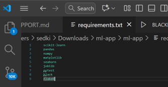
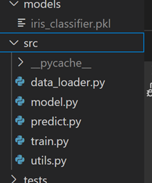

## Task 2: Run the App Locally

### Commands Executed:
```bash
python -m venv venv
venv\Scripts\activate
pip install -r requirements.txt
python src/train.py
```

### Results:
-  Virtual environment created successfully
-  All dependencies installed correctly
  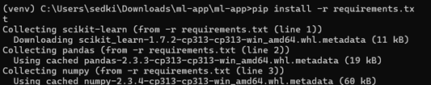
-  Training script executed without errors
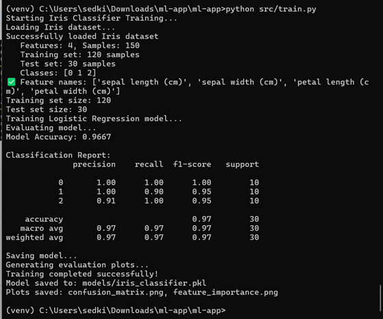
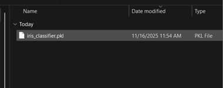
The script trained the model, tested it against sample data, printed a confusion matrix, and saved the model under the `./models` folder.

## Task 3: Write Unit Tests

### Test Execution:
```bash
python -m pytest ./tests/test_model.py
```
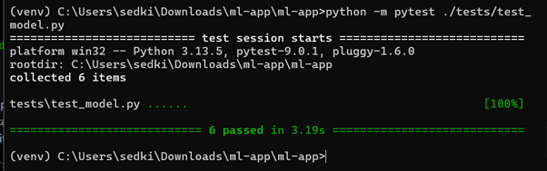
### Additional Tests Added:
I enhanced the existing test suite by adding three critical validation layers to ensure data quality, model consistency, and proper error handling in production scenarios:

#### 1. `test_invalid_predict_before_training()`
- **Purpose:** Verify that the model fails gracefully when attempting predictions before training
- **Importance:** Critical robustness test that prevents silent bugs and ensures proper error handling
- **Implementation:** Tests that `ValueError` is raised when calling `predict()` on an untrained model

#### 2. `test_model_consistency()`
- **Purpose:** Verify that the model gives identical predictions for identical inputs
- **Importance:** Ensures reproducibility and model consistency across multiple predictions
- **Implementation:** Compares predictions from the same input sample executed twice

#### 3. `test_data_quality()`
- **Purpose:** Verify that the dataset contains no corrupted values (NaN, infinite)
- **Importance:** Data quality is crucial for reliable machine learning model performance
- **Implementation:** Checks for absence of NaN and infinite values in training and test datasets
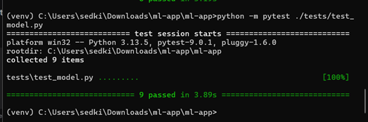
### Verification:
-  All tests run locally with pytest
-  Test suite provides comprehensive coverage

## Task 4: Linting & Formatting

1. Created `.flake8` configuration file with:
   ```ini
   ignore = E203, E266, E501, W503, E402
   ```
   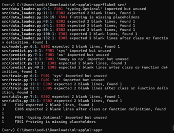
    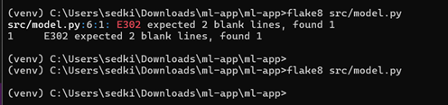
3. Added blank lines to fix E302 errors and improve code formatting
    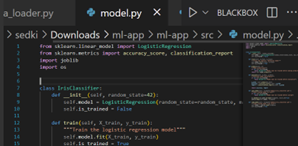
    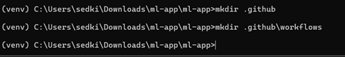
5. Code quality standards enforced

## Task 5: GitHub Actions CI Workflow

1. Created `.github/workflows/ci.yml` configured to trigger on `push` and `pull_request` events
 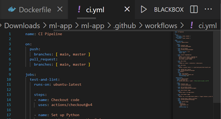
 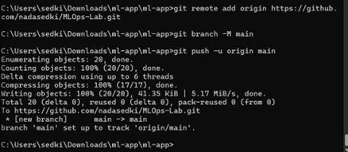
### Workflow Steps:
-  Checkout the code
-  Set up Python environment
-  Install dependencies
-  Run the linter
-  Execute tests and produce test results/artifacts
-  Build Docker image and upload as artifact
 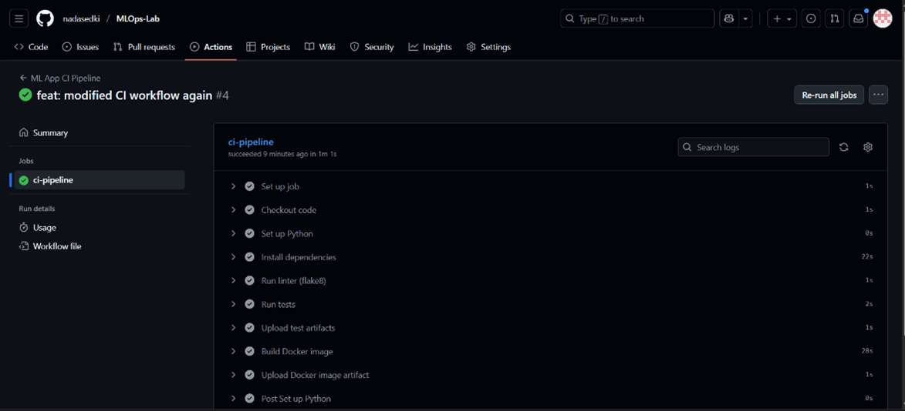
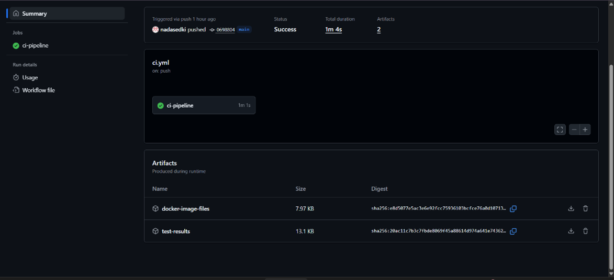

### Results:
-  Workflow successfully triggered on push to GitHub
-  All steps executed without errors
-  Artifacts generated: test-results and docker-image
-  Total execution duration: 1 minute 4 seconds

## Task 6: Containerize the Application

1. Added comprehensive `Dockerfile` for containerization
   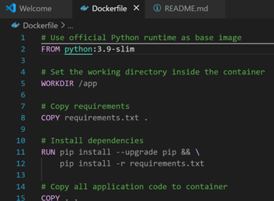
   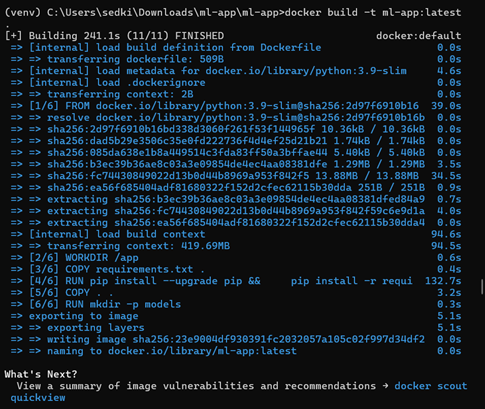
3.  Dockerfile produces runnable container that properly exposes application port
4.  Successfully built Docker image and executed training using dockerized application

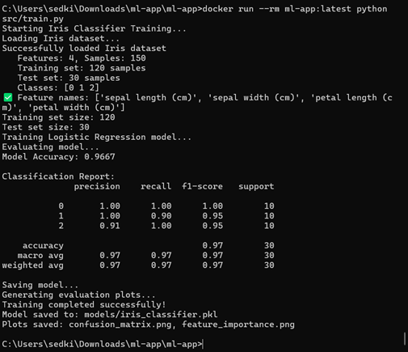
### Tests:
-  Functional container confirmed
-  Model training executes correctly within container environment

## Conclusion

A complete CI/CD pipeline has been successfully implemented covering all essential aspects:

-  **Local Development Environment**
-  **Automated Testing Framework**
-  **Code Quality Enforcement**
-  **Containerization**
-  **Continuous Integration**

All assigned tasks have been completed with execution evidence and the pipeline is fully operational. The MLOps implementation ensures reliable, reproducible, and production-ready machine learning workflows.

---

**Report Generated for DevOps Assignment - ML CI/CD Pipeline**
